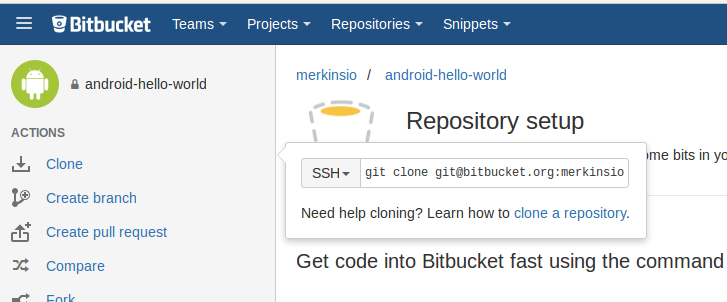
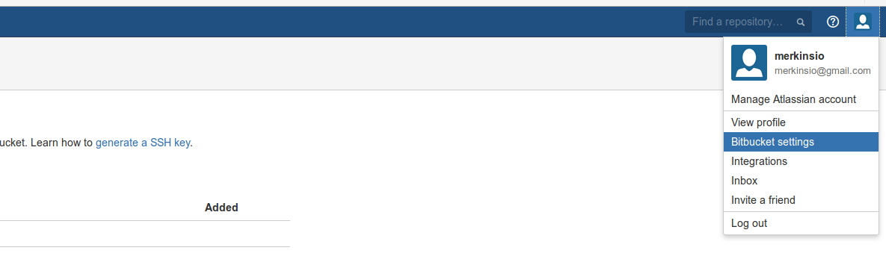
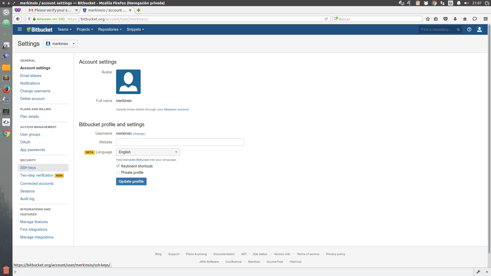
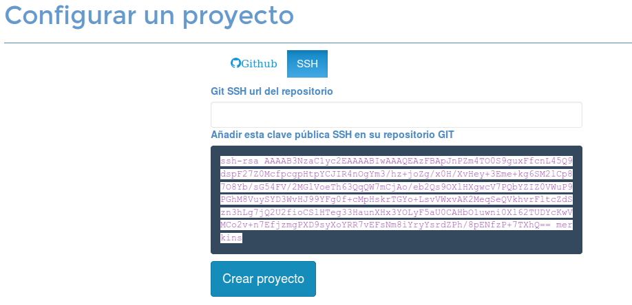
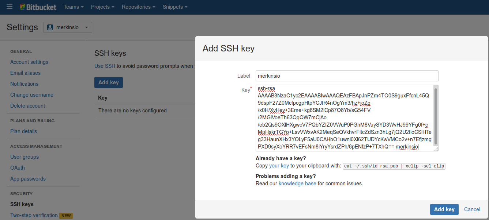
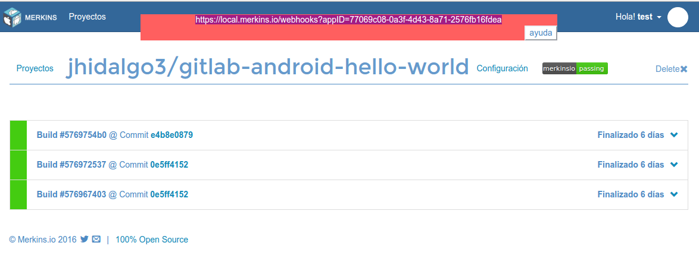
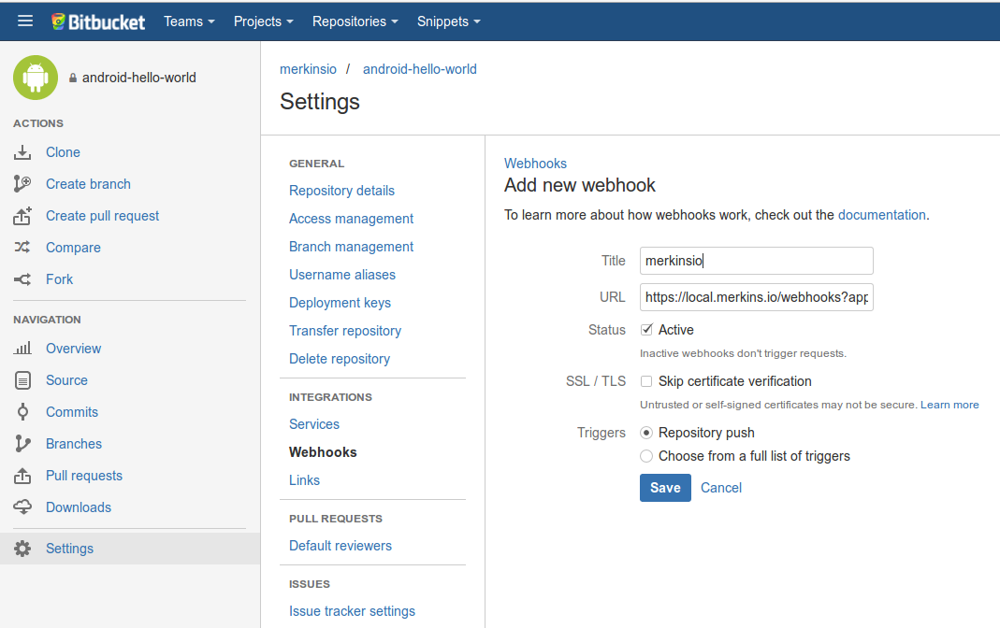
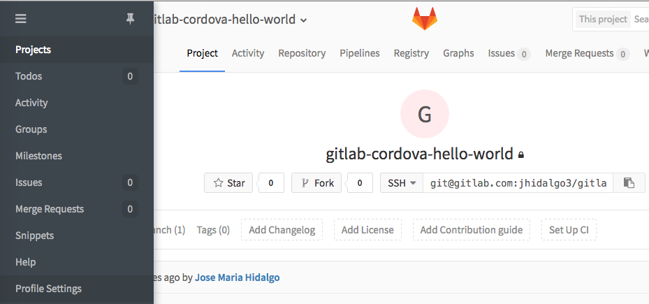
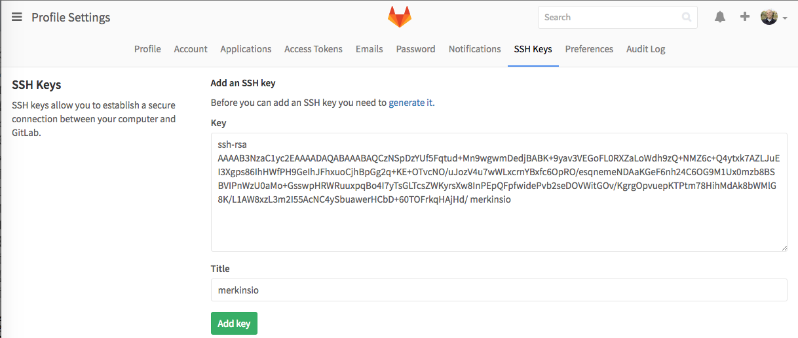
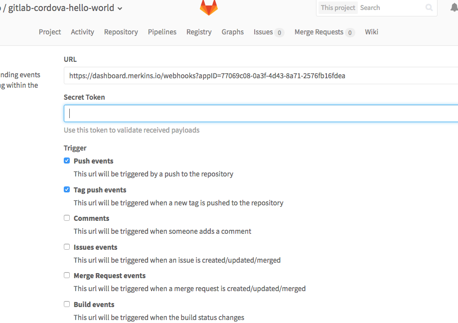

************************************
Configuración de repositorios GIT
************************************

GITHUB
====================
.. note::
    Gracias a la integración de Merkinsio con el API de Github no es necesario
    realizar ninguna configuración adicional en el repositorio.

BITBUCKET
================

.. note::
   * Paso 1: **Bitbucket - Localizar la URL SSH Git Clone URL**
   * Paso 2: **Bitbucket - Añadir la clave pública del Merkinsio al usuario**
   * Paso 3: **Bitbucket - Webhooks para Merkinsio**

Bitbucket - Configurar SSH Git Clone URL
-----------------------------

Bitbucket - Añadir la clave pública del Merkinsio al usuario
-------------------------------------------------------------

Acceder al panel de configuración del usuario de Bitbucket

Seleccionar el menu `security->SSH Keys`

Copiar la clave pública que se ha generado en Merkinsio

Finalmente añadir la clave pública para habilitar que Merkinsio pueda
acceder a este repositorio

Bitbucket - Webhooks para Merkinsio
------------------------------------

Para que Merkinsio compile en cada cambio de código es necesario configurar
un webhook en el respositorio.

La url que se necesita copiar es la URL que aparece cuando se accede a la pantalla
del proyecto en Merkinsio.

En la imagen la URL a copiar en Bitbucket es ``https://dashboard.merkins.io/webhooks?appID=77069c08-0a3f-4d43-8a71-2576fb16fdea``
acceder a la configuración del repositorio de bitbucket y dar de alta la url como un nuevo webhook.

GITLAB
==================

.. note::
   * Paso 1: **Gitlab - Localizar la URL SSH Git Clone URL**
   * Paso 2: **Gitlab - Añadir la clave pública del Merkinsio al usuario**
   * Paso 3: **Gitlab - Webhooks para Merkinsio**

Gitlab - Localizar la URL SSH Git Clone URL
--------------------------------------------

   .. image:: _static/gitlab/gitlab_1_ssh_url.png
        :alt: Normal mode

Gitlab - Añadir la clave pública del Merkinsio al usuario
----------------------------------------------------------

Acceder al panel de perfil del usuario de Bitbucket

Seleccionar el menu `SSH Keys`

Copiar la clave pública que se ha generado en Merkinsio

Finalmente añadir la clave pública para habilitar que Merkinsio pueda
acceder a este repositorio

Gitlab - Webhooks para Merkinsio
---------------------------------

Para que Merkinsio compile en cada cambio de código es necesario configurar
un webhook en el respositorio.

La url que se necesita copiar es la URL que aparece cuando se accede a la pantalla
del proyecto en Merkinsio.

En la imagen la URL a copiar en Gitlab es ``https://dashboard.merkins.io/webhooks?appID=77069c08-0a3f-4d43-8a71-2576fb16fdea``
acceder a la configuración del repositorio de Gitlab y dar de alta la url como un nuevo webhook.

